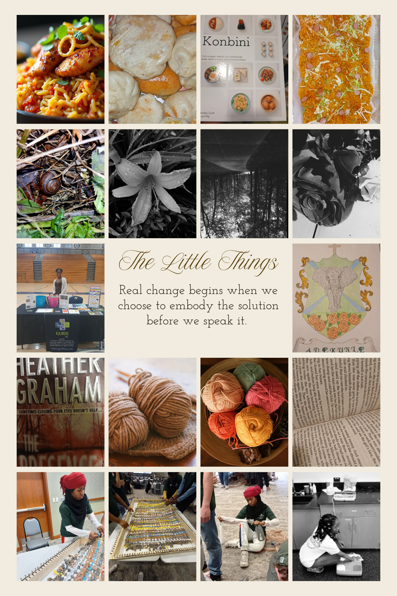

## Professional Biography

I am a developing public health professional committed to advancing health equity through prevention, communication, and community-centered program management. My aspiration include designing, leading, and evaluating programs that reduce preventable harms, especially suicide, chronic disease, and inequities affecting underserved communities.

My past and current work combines and shows creativity, research, and leadership, from developing resource directories and educational materials to understanding why health problems occur and creating solutions that will empower communities. I believe my interests (in communication, behavioral health, and artistic projects) and past experiences (e.g., R.A.L.M research, resource website, and thesis on stress or nicotine from my undergraduate thesis) demonstrate my goal and reasons.

## Additional Interests

- Behavioral health communication.

- Suicide prevention.

- Community-centered program design.

## Professional Goals

- Lead prevention-focused programs.

- Strengthen community health systems.

- Develop accessible public health resources.

{.float-headshot}

## Hobbies

- World-flavor experimenting
- Drawing and painting
- Humanitarian outreach
- Literary exploration
- Traveling
- Handwoven creation
- Photography
