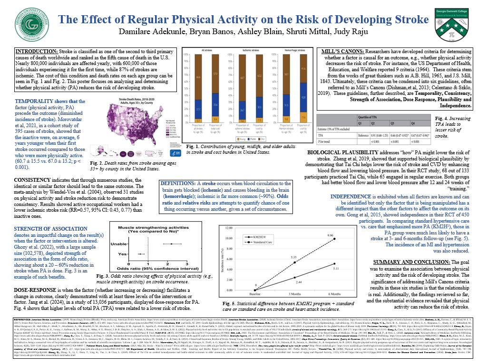

This page includes presentations, covering different aspects from Reducing Access to Lethal Means to Windshield Survey for NPU I Atlanta, Effects of Physical Activity on Stroke Development, and so on.

## Reducing Access to Lethal Means (R.A.L.M) Presentation

[R.A.L.M Booklet Presentation](files/RALM-Booklet-Preview-PAC-G-Presentation.pptx)

## Atlanta Windshield Community Health Assessment

[NPU I Community Assessment Presentation](files/NPU-I-Windshield-Survey-Community-Assessment-Presentation.pptx)

## Stress and Nicotine on Nutrition and Chronic Diseases

[Effects of Stress and Nicotine on Nutrition](files/Capstone-(Stress-and-Nicotine)-Presentation.pptx)

  - The aim of this systematic review was to explore the impacts of stress and nicotine products on nutrition and chronic diseases in individuals aged 18–25, with a particular focus on college students. Their correlation with psychological health, physical health, and various lifestyle factors had become a critical area of study. Stress was strongly correlated with nicotine use, particularly in young adults experiencing heightened levels of stress. Reports from organizations such as the National Institute on Drug Abuse (NIDA) and the National Institutes of Health (NIH) showed the growing trend of vaping among this population. 

## C.R.E.A.T.E Presentation

 

[The Effect of Regular Physical Activity on the Risk of Developing Stroke](files/PA-STR-CREATE-Final-Poster.pptx)

  - The effects of physical activity and the risk of stroke development were analyzed using the Mill's Canons. 
