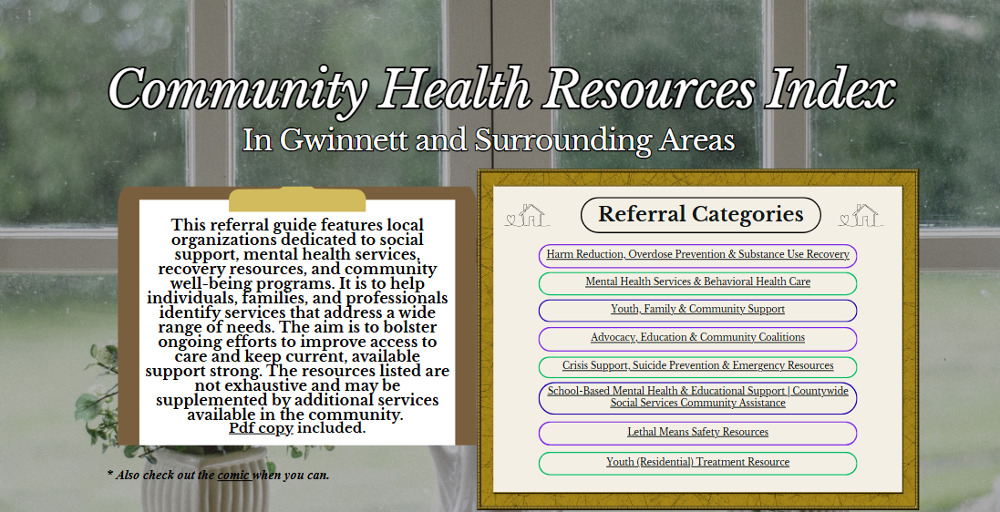
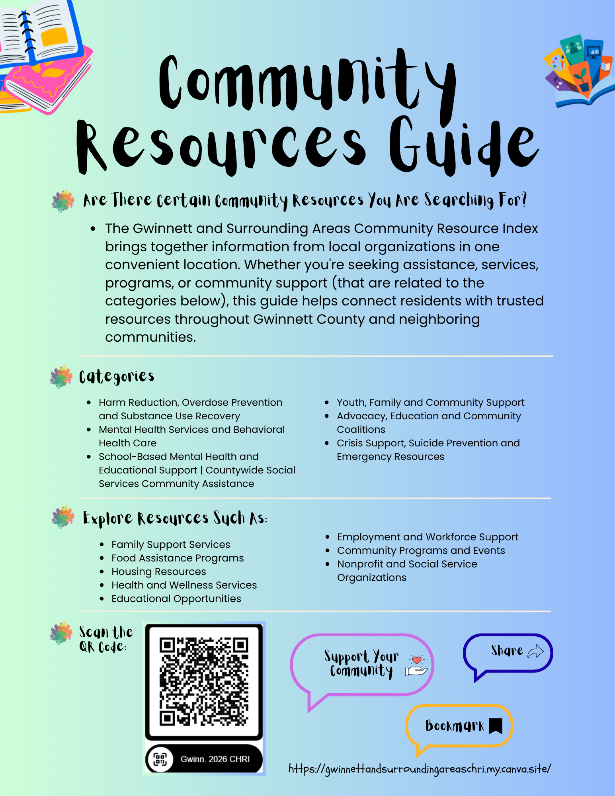

This page illustrates past and current projects relating to community health impact, data analysis, health communication, and data visualization.

## Gwinnett and Surrounding Resource Website

A public-oriented resource directory with gathered information from organizations across Gwinnett and nearby areas. It includes local services, programs, and support resources all in one place for community members.

[Explore the site and its categories](https://gwinnettandsurroundingareaschri.my.canva.site/)

### Gwinnett and Surrounding Resource Flyer

You can help spread the word by sharing the flyer below.  

## DeeFam Inc. Comic Design

Follow the comic's narrative, which addresses myths about suicide and harms from firearms, as well as underscores the importance of checking in. Material derived from the Georgia Department of Behavioral Health and Developmental Disabilities (DBHDD).

[Read the comic here or view directly below by clicking the play button.](https://heyzine.com/flip-book/1202f80a75.html)

  <video class="full-video" controls>
    <source src="files/deefam-comic-video.mp4" type="video/mp4">
    Your browser does not support the video tag.
  </video>

## Visualizations

[Visit my GitHub](https://github.com/Damilare-Adekunle1), navigating through the data visualization course repository to see some of the visualizations created using R, Quarto, and ggplot2.
